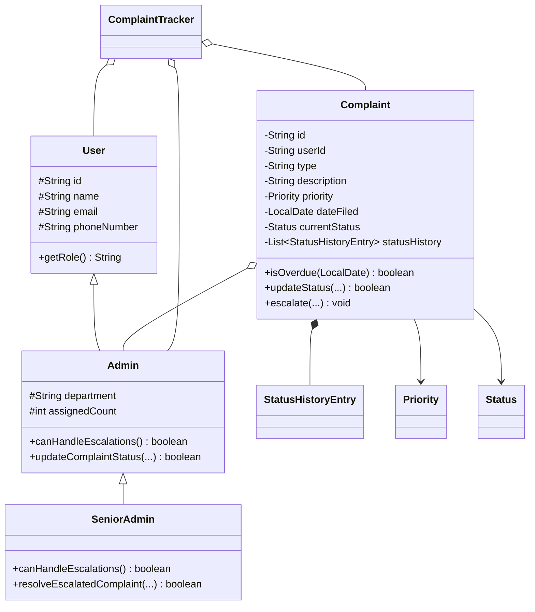

# Complaint Management System — Comprehensive Design Document

## 1. Executive Summary
The Complaint Management System is an enterprise-grade Java application designed around core **Object-Oriented Programming (OOP)** principles. It manages the complete lifecycle of customer complaints—from submission and priority-based classification to SLA tracking, automated supervisor escalation, administrative updates, and final closure.

---

## 2. Object-Oriented Programming (OOP) Principles Applied

### 2.1 Encapsulation
- All instance variables in domain models (`Complaint`, `User`, `Admin`, `StatusHistoryEntry`) are marked `private` or `protected`.
- State mutations (such as changing a complaint's status or priority) cannot be performed through direct variable access. They are mediated through domain methods (`updateStatus`, `escalate`, `closeComplaint`) that validate inputs, enforce state invariants, and automatically append immutable audit logs.

### 2.2 Inheritance & Class Hierarchy
- **Base Class**: `User` encapsulates universal human actor attributes (`id`, `name`, `email`, `phoneNumber`).
- **Single Inheritance**: `Admin extends User` introduces administrative attributes (`department`, `assignedCount`) and status updating capabilities.
- **Multilevel Inheritance**: `SeniorAdmin extends Admin extends User` introduces executive powers, enabling automated escalation handling and senior sign-off.

```
       ┌────────────────────────┐
       │          User          │
       └───────────┬────────────┘
                   │
                   ▼
       ┌────────────────────────┐
       │         Admin          │
       └───────────┬────────────┘
                   │
                   ▼
       ┌────────────────────────┐
       │      SeniorAdmin       │
       └────────────────────────┘
```

### 2.3 Polymorphism
- **Dynamic Method Dispatch**: Subclasses override `getRole()` (`"USER"`, `"ADMIN"`, `"SENIOR_ADMIN"`) and `canHandleEscalations()` (`false` for regular Admins, `true` for SeniorAdmins).
- **Comparator Polymorphism**: Custom `Comparator<Complaint>` implementations enable dynamic sorting by priority weight (`HIGH` > `MEDIUM` > `LOW`) or chronologically by date.

### 2.4 Abstraction & Modularity
- The system is architected into three distinct packages:
  - `com.complaintsystem.model`: Domain entities and enums.
  - `com.complaintsystem.tracker`: Service layer, state management, and escalation engine.
  - `com.complaintsystem.app`: CLI console interface and test execution harness.

---

## 3. Class Specifications

### 3.1 `Priority` (Enum)
Defines ticket urgency and Service Level Agreement (SLA) escalation limits:
- `LOW`: 10 days before escalation.
- `MEDIUM`: 5 days before escalation.
- `HIGH`: 2 days before escalation.
- Method: `int getEscalationDays()`.

### 3.2 `Status` (Enum)
Defines lifecycle states:
- `OPEN`: Newly submitted, unassigned or pending triage.
- `IN_PROGRESS`: Actively under investigation by an assigned Admin.
- `ESCALATED`: SLA breached; reassigned to Senior Admin.
- `RESOLVED`: Solution provided; awaiting closure.
- `CLOSED`: Fully finalized and archived.
- Method: `boolean isUnresolved()` — returns `true` for `OPEN` and `IN_PROGRESS`.

### 3.3 `StatusHistoryEntry` (Class)
Maintains an immutable audit log of every transition:
- **Attributes**: `oldStatus` (Status), `newStatus` (Status), `updatedBy` (String), `timestamp` (LocalDate), `remarks` (String).
- **Methods**: Standard getters and formatted `toString()` for display.

### 3.4 `User` (Class)
- **Attributes**: `id` (String), `name` (String), `email` (String), `phoneNumber` (String).
- **Methods**: Getters, setters, `getRole()`, `displayProfile()`, `equals()`, `hashCode()`, `toString()`.

### 3.5 `Admin` (Class, extends `User`)
- **Attributes**: Inherits from `User`; adds `department` (String), `assignedCount` (int).
- **Methods**: `getDepartment()`, `canHandleEscalations()` (returns `false`), `updateComplaintStatus(...)`, `closeComplaint(...)`.

### 3.6 `SeniorAdmin` (Class, extends `Admin`)
- **Attributes**: Inherits from `Admin`.
- **Methods**: Overrides `canHandleEscalations()` to return `true`, `resolveEscalatedComplaint(...)`.

### 3.7 `Complaint` (Class)
- **Attributes**: `id`, `userId`, `type`, `description`, `priority`, `dateFiled`, `currentStatus`, `assignedAdmin`, `statusHistory` (List<StatusHistoryEntry>), `resolutionNotes`.
- **Key Methods**:
  - `isOverdue(LocalDate referenceDate)`: Evaluates whether `daysElapsed > priority.getEscalationDays()`.
  - `updateStatus(Status, Admin, String, LocalDate)`: Transitions status and records history.
  - `escalate(SeniorAdmin, LocalDate, String)`: Sets status to `ESCALATED`, binds senior admin, records remarks.
  - `getDetailsFormatted()`: Generates detailed summary with full audit history for the CLI.

### 3.8 `ComplaintTracker` (Class)
Central service coordinator:
- **Attributes**: `complaints` (Map<String, Complaint>), `users` (Map<String, User>), `admins` (Map<String, Admin>), `complaintIdSequence` (int).
- **Key Methods**:
  - `fileComplaint(userId, type, description, priority, dateFiled)`: Validates user, generates `CMP-xxxx` ID, initializes complaint.
  - `getComplaint(complaintId)`: Retrieves complaint by unique ID.
  - `filterByStatus(Status)`: Returns filtered subset.
  - `filterByPriority(Priority)`: Returns filtered subset.
  - `sortByPriority(boolean highFirst)`: Sorts high-to-low or low-to-high.
  - `sortByDateFiled(boolean newestFirst)`: Sorts chronologically.
  - `checkAndEscalate(LocalDate referenceDate)`: Identifies all overdue complaints and escalates them to a Senior Admin.
  - `updateComplaintStatus(...)`: Validates admin authorization and updates status.

---

## 4. Class Diagram & Relationships



---

## 5. Escalation Rule Formulation

For any complaint $C$ evaluated at date $D_{ref}$:
$$\text{DaysElapsed} = \text{ChronoUnit.DAYS.between}(C.dateFiled, D_{ref})$$
$$\text{IsOverdue} = C.currentStatus \in \{\text{OPEN}, \text{IN\_PROGRESS}\} \land (\text{DaysElapsed} > C.priority.getEscalationDays())$$

When triggered:
1. $C.currentStatus \leftarrow \text{ESCALATED}$
2. $C.assignedAdmin \leftarrow \text{findAvailableSeniorAdmin}()$
3. A timestamped audit entry is logged in $C.statusHistory$.
